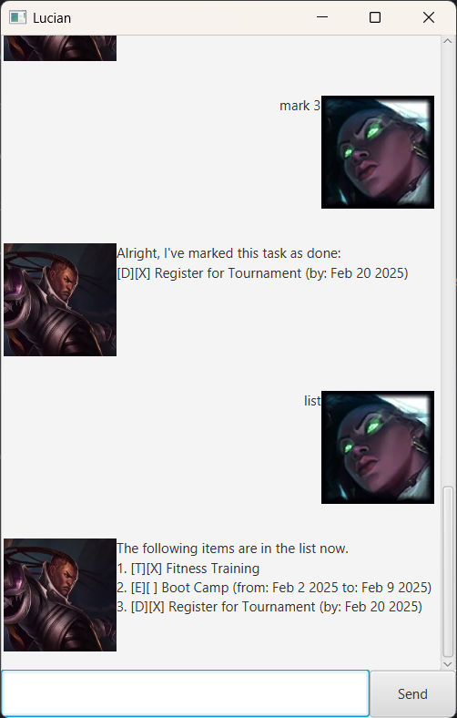

# Lucian User Guide


This is Lucian(chatbot), a character from the game League of Legends, and he is helping Senna(user), his wife, keep track of various tasks that have to be done.
The type of tasks include:
1. todo: A task that just needs to be done
2. deadline: A task that has to be done by a specific deadline
3. event: A task that will be done on a defined duration.

Note that the expected outputs given below are on the assumption that all commands stated have been executed sequentially.

## Adding todo task
This is one of the tasks that can be added to the chatbot and it just describes what needs to be done.

The command to enter is as follows:\
`todo Buy items`

Output:
```
Roger. I'll be adding this task to the list:
[T][] Buy items
Now you have 1 tasks in the list.
```

## Adding deadline task
This is one of the tasks that can be added to the chatbot and it describes what needs to be done and by when.

The command to enter is as follows:\
`deadline Kill Baron Nashor /by 2025-02-19`

Output:
```
Roger. I'll be adding this task to the list:
[D][] Kill Baron Nashor (by: Feb 19 2025)
Now you have 2 tasks in the list
```


## Adding event task
This is one of the tasks that can be added to the chatbot and it describes what needs to be done where the start and end dates have to be specified.

The command to enter is as follows:\
`event Lead the Sentinels to seal away Viego /from 2025-03-01 /to 2025-12-12`

Output:
```
Roger. I'll be adding this task to the list:
[E][] Lead the Sentinels to seal away Viego (from: Mar 1 2025 to: Dec 12 2025)
Now you have 3 tasks in the list
```

## List out tasks
This lists out all tasks that have been added and stating all information associated with each task.

The command to enter is as follows:\
`list`

Output:
```
The following items are in the list now.
1. [T][] Buy items
2. [D][] Kill Baron Nashor (by: Feb 19 2025)
3. [E][] Lead the Sentinels to seal away Viego (from: Mar 1 2025 to: Dec 12 2025)
```

## Find tasks
This lists out all tasks that have a specified keyword in their description.

The command to enter is as follows:\
`find Baron`

Output:
```
The following items match the keyword.
1. [D][] Kill Baron Nashor (by: Feb 19 2025)
```

## Mark task
This marks a task in the list as completed

The command to enter is as follows:\
`mark 2`

Output:
```
Alright, I've marked this task as done:
[D][X] Kill Baron Nashor (by: Feb 19 2025)
```

## Unmark task
This unmarks a completed task in the list.

The command to enter is as follows:\
`unmark 2`

Output:
```
Task marked as not done yet:
[D][] Kill Baron Nashor (by: Feb 19 2025)
```

## Statistics of tasks
This provides a brief summary of the tasks that have been stored, such as the number of tasks, number of completed tasks and the most common type of task.

The command to enter is as follows:\
`stats`

Output:
```
Task Statistic:
- Total tasks: 3
- Completed tasks: 0 (0.0%)
- Most common task type: ToDo
```

## Delete task
This deletes a specified task that has been previously added.

The command to enter is as follows:\
`delete 2`

Output:
```
Sure, I'll remove this task:
[D][] Kill Baron Nashor (by: Feb 19 2025)
Now you have 2 tasks in the list
```

## Exit chatbot
This ends the current session, and stores all the information that has been added for future sessions.

The command to enter is as follows:\
`bye`
